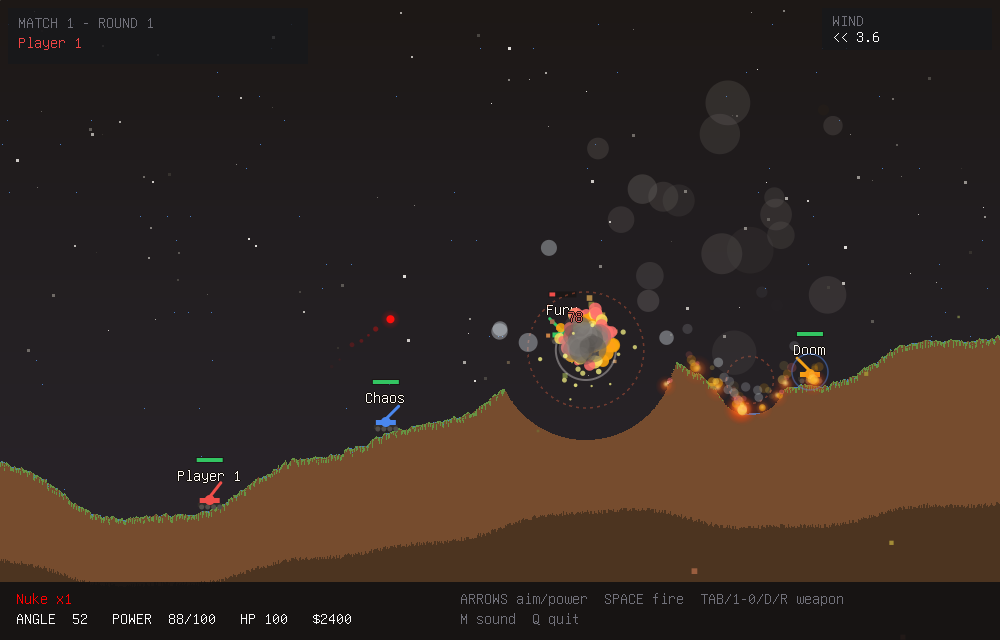

# Bashed Earth

Turn-based artillery combat in your terminal, in the grand tradition of
Scorched Earth and Worms — rendered as real pixels via the **kitty
graphics protocol**. No SDL, no X11, no ncurses: the whole game is a
software-rasterized, antialiased framebuffer zlib-compressed and streamed
to the terminal as base64 APC escape sequences at a steady 30 fps
(double-buffered image ids + DEC 2026 synchronized updates, so no flicker;
encoding runs on its own thread, so no stutter).

Built for [kilix](https://github.com/itsmygithubacct/kilix) (and any
kitty-protocol terminal: kitty, ghostty, wezterm...). **Linux only.**



## Features

- **Falling-sand destructible terrain** — 1px cellular automaton with
  grass/sand/ice worlds, lakes, flowing water, snow, and ice that shatters
  into avalanches when explosions cut it loose
- **15 weapons** — from the Baby Missile to the Nuke: Triple, Bouncy,
  Roller (rolls downhill into dug-in tanks), Drill, Digger, Napalm
  (spreads burning fire that creeps downhill and is doused by water),
  Dirt, MIRV, plus Raft / Parachute / Shield utility items
- **Weapon store & economy** — $10k per match, leftover cash and unused
  ammo carry across matches, winner bonus, multi-match scoreboard
- **5 AI personalities** — Aggressive, Defensive, Tactical, Balanced,
  Trickster; each with its own shopping list, weapon priorities, aim
  accuracy, taunts, and name pool
- **Weather** — wind that pushes shells, rain that fills craters, snow
  that buries ice worlds
- **Hazards** — fall damage (parachutes save you), buried-alive damage,
  self-hits, and a stalemate rule so dug-in wars end
- **Locally generated sound bank** — 14 reviewed shot, explosion, impact,
  splash, ricochet, UI, and victory WAVs load at startup; the drill and any
  missing or invalid asset use the built-in synthesized fallback. Everything
  is mixed live and streamed to whatever audio sink your system has
  (`pacat` / `pw-play` / `aplay` / sox `play`); silently disabled if none

## Build

Linux only. Needs gcc or clang, zlib, libm, and pthreads:

```sh
make
./bashed-earth
```

Sound plays through the first available CLI sink (`pacat`, `pw-play`,
`aplay`, or sox's `play`) — no sink, no sound, no problem.

## Controls

| Key | Action |
|-----|--------|
| Left / Right | aim barrel |
| Up / Down | power |
| Space / Enter | fire |
| 1-0 | weapon hotkeys |
| D / R | Drill / Roller |
| Tab | cycle weapons |
| M | toggle sound |
| Q | quit |

Menus: arrows to navigate, Left/Right to change values, Enter to confirm.
Options persist to `~/.config/bashed-earth.conf`.

## Development

```sh
make test                          # headless AI-vs-AI selftest matches
./bashed-earth --selftest 42 3     # specific seed, 3 matches
./bashed-earth --render-test 7     # dump render_*.ppm screenshots
BE_DEBUG=1 ./bashed-earth --selftest 1 1   # tick-by-tick state trace
```

The selftest plays full 4-AI matches headlessly (store, combat, economy,
carry-over) and checks invariants — no terminal needed, so it runs in CI.

## Architecture

| File | Role |
|------|------|
| `src/term.c` | key decoding around the vendored `kitty-framebuffer` session |
| `src/terrain.c` | falling-sand automaton with per-row active-span tracking |
| `src/game.c` | tanks, projectiles, flames, explosions, AI, store, turn flow |
| `src/render.c` | scene, HUD, menus, and Scale2x/3x text over vendored `soft-raster` primitives |
| `src/sound.c` | reviewed WAV bank + procedural fallback routed through vendored `pcm-mixer` |
| `src/config.c` | weapon/AI/color data tables |
| `src/main.c` | 30 fps loop (60 Hz logic), selftest, render-test |

The three shared runtime libraries are vendored under `third_party/`, so a
normal checkout remains self-contained.

## License

Code is MIT; the shipped SFX bank is CC0-derived. See [LICENSE](LICENSE) and
[the per-file audio provenance](docs/audio-provenance.json). The embedded terminal font comes from
Debian console-setup's public-domain console fonts (details in
`src/font8x16.h`).
